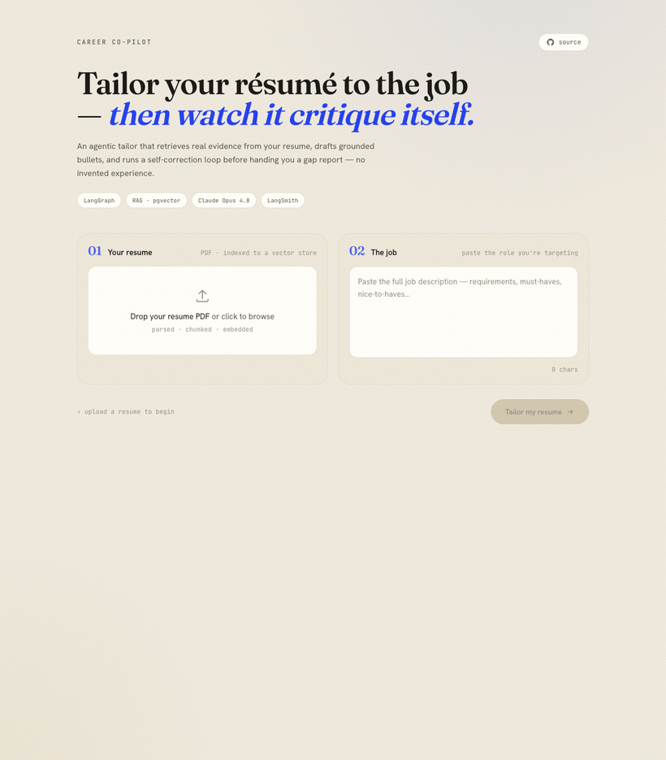

# Career Co-pilot


An **agentic resume-tailoring and gap-analysis** tool for job seekers — built to
showcase production AI engineering: LangGraph (a self-correcting agent loop),
LangChain, a pgvector RAG pipeline, and end-to-end observability with LangSmith.

See [`DESIGN.md`](./DESIGN.md) for the full architecture and rationale.

<p align="center">
  
</p>

## Table of Contents

- [Stack](#stack)
- [Prerequisites](#prerequisites)
- [Quick start](#quick-start)
- [Tests](#tests)
- [Project layout](#project-layout)
- [Contributing](#contributing)
- [Code of Conduct](#code-of-conduct)
- [License](#license)
- [Roadmap](#roadmap)
- [Acknowledgements](#acknowledgements)

> **Status:** Step 5 of 7 — the LangSmith eval suite (LLM-as-judge
> groundedness / JD-relevance / gap-recall over a seed dataset). The
> self-correcting `critic → revise` loop and `/tailor` are live. Build plan
> lives in `DESIGN.md` §9.

## Stack

| Layer | Choice |
|---|---|
| Backend | Python 3.12+, FastAPI |
| Agent | LangGraph (`critic → revise` loop) |
| RAG | LangChain + pgvector |
| Embeddings | local `bge-small` (dev default) · Voyage `voyage-3` (set `EMBEDDINGS_PROVIDER=voyage`) |
| LLM | Claude Opus 4.8 (draft/critic) + Haiku 4.5 (cheap nodes) |
| Observability | LangSmith |
| Frontend | Next.js 16 + Tailwind v4 *(later step)* |

## Prerequisites

- Python 3.12+
- A Postgres + pgvector database. Two options:
  - **Supabase** (current setup) — enable the `vector` extension, then use the
    **Session pooler** URI (port 5432, *not* the 6543 transaction pooler) as
    `DATABASE_URL`.
  - **Local** — `docker-compose up -d` (see `docker-compose.yml`); needs a
    running Docker daemon (Docker Desktop / Colima / OrbStack).
- API keys (from build step 2+): Anthropic, Voyage, LangSmith.

## Quick start

```bash
# 1. Config — set DATABASE_URL (Supabase session pooler) + VOYAGE_API_KEY
cp .env.example .env        # or put machine-local secrets in .env.local

# 2a. Supabase: enable pgvector once
#     CREATE EXTENSION IF NOT EXISTS vector WITH SCHEMA extensions;
# 2b. ...or run a local pgvector instead:
#     docker-compose up -d

# 3. Backend
cd backend
python -m venv .venv && source .venv/bin/activate
pip install -e ".[dev,rag]"     # add ".[local]" for the offline bge embeddings
uvicorn api.main:app --reload --port 8000

# 4. Verify
#   open http://localhost:8000/health  -> {"status":"ok",...}
#   open http://localhost:8000/docs    -> Swagger UI
```

`settings.py` loads `.env` and `.env.local` (later wins), so secrets can live in
either. `DATABASE_URL` is rewritten to the `postgresql+psycopg://` driver
internally.

### Ingest a resume

```bash
# Needs DATABASE_URL reachable + VOYAGE_API_KEY set
curl -F "file=@/path/to/resume.pdf" http://localhost:8000/ingest
# -> {"resume_id":"...","chunk_count":12}
```

### Tailor against a job description

```bash
# Needs ANTHROPIC_API_KEY (+ LANGCHAIN_API_KEY for tracing) in .env
curl -X POST http://localhost:8000/tailor \
  -H 'content-type: application/json' \
  -d '{"resume_id":"...","job_description":"We are hiring a Senior Backend Engineer ..."}'
# -> {"tailored_bullets":[...], "gaps":[...], "summary":"..."}
```

> **Voyage free tier is 3 requests/min.** `retrieve_evidence` batches all
> requirement queries into a single embedding call to stay under it; if you see
> a Voyage `RateLimitError`, add a payment method (the 200M free tokens still
> apply) or set `EMBEDDINGS_PROVIDER=local` for the offline `bge` fallback.

### Run the eval suite

```bash
cd backend && source .venv/bin/activate   # needs ".[dev,rag,local]"
python -m eval.run_eval --limit 1   # smoke test (~cents)
python -m eval.run_eval             # full dataset (~$1-2 of Anthropic credit)
# LLM-as-judge groundedness / jd_relevance / gap_recall -> LangSmith experiment
```

### Embeddings provider

`EMBEDDINGS_PROVIDER=local` (default) uses `bge-small` via `sentence-transformers`
— free, offline, no rate limits; ideal for eval loops. Set
`EMBEDDINGS_PROVIDER=voyage` for `voyage-3` (the "production" path). The two use
different vector dimensions, so each writes to its own pgvector collection
(`resume_chunks_<provider>`); switching providers re-indexes.

### Inspect the graph (`langgraph dev`)

```bash
cd backend && source .venv/bin/activate   # needs ".[dev]"
langgraph dev                              # opens the LangGraph Studio UI
```

## Tests

```bash
cd backend && source .venv/bin/activate
pytest -q
```

## Project layout

```
career-copilot/
├── backend/        # FastAPI app, LangGraph agent, RAG, evals
│   ├── api/        # routes + schemas  (step 1: /health)
│   ├── graph/      # LangGraph state machine  (step 3+)
│   ├── rag/        # ingest + retrieval        (step 2+)
│   ├── eval/       # LangSmith eval suite       (step 5+)
│   └── tests/
├── db/init/        # pgvector bootstrap SQL
├── docker-compose.yml
├── DESIGN.md
└── AGENTS.md
```

## Contributing

Contributions are welcome! Please open an issue first to discuss what you'd like to change.

1. Fork the repo
2. Create a feature branch (`git checkout -b feature/your-feature`)
3. Commit your changes (`git commit -m 'feat: describe change'`)
4. Push and open a pull request

Please make sure tests pass (`cd backend && pytest -q`) before submitting a PR.

## Code of Conduct

This project follows the [Contributor Covenant v2.1](https://www.contributor-covenant.org/version/2/1/code_of_conduct/).
By participating you agree to uphold a welcoming, harassment-free environment.

## License

Distributed under the MIT License. See [LICENSE](LICENSE) for details.

## Roadmap

Full build plan in [`DESIGN.md`](./DESIGN.md) §9. High level:

- [x] **1–2.** Repo skeleton + RAG ingest (PDF → chunk → embed → pgvector)
- [x] **3.** LangGraph spine (`parse_jd → retrieve → gap_analysis → draft → assemble`)
- [x] **4.** Self-correcting `critic → revise` loop (bounded by `MAX_REVISIONS`)
- [x] **5.** LangSmith eval suite (LLM-as-judge groundedness / relevance / gap-recall)
- [ ] **6.** Next.js frontend
- [ ] **7.** Polish, trace/eval screenshots, deploy

## Acknowledgements

- [LangChain](https://github.com/langchain-ai/langchain) & [LangGraph](https://github.com/langchain-ai/langgraph)
- [Anthropic Claude](https://www.anthropic.com/) for generation, [Voyage AI](https://www.voyageai.com/) for embeddings
- [pgvector](https://github.com/pgvector/pgvector) on [Supabase](https://supabase.com/)
